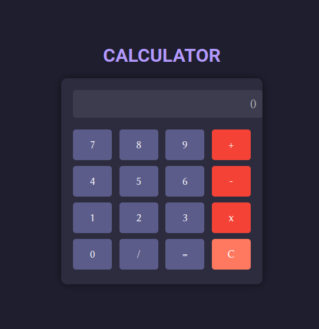

# Calculator Project

This is an interactive and modern calculator application built with HTML, CSS, and JavaScript.

## Features

- Basic arithmetic operations: addition, subtraction, multiplication, and division
- Responsive design with a visually appealing interface
- Keyboard support for number and operation keys

## How to Run

1. Open `index.html` in a web browser.
2. Interact with the app by performing arithmetic operations using the buttons or your keyboard.

## Preview

