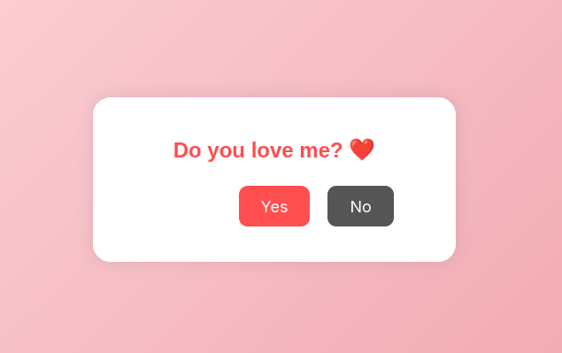

# Love Site ❤️

A romantic interactive website where you can express your love in a fun and playful way!

## Features

- Interactive love questions
- Dodging "No" button that moves away when you try to click it
- Beautiful heart animations
- Romantic gradient background
- Mobile responsive design

## Installation

1. Clone this repository
2. Install dependencies:
```bash
 npm install
```

## Running Locally

```bash
npm start
```

Then open your browser and go to `http://localhost:3000`

> Or just run 'firefox index.html' for quick access!

## Technologies Used

- HTML5
- CSS3
- JavaScript
- Express.js

## Preview

