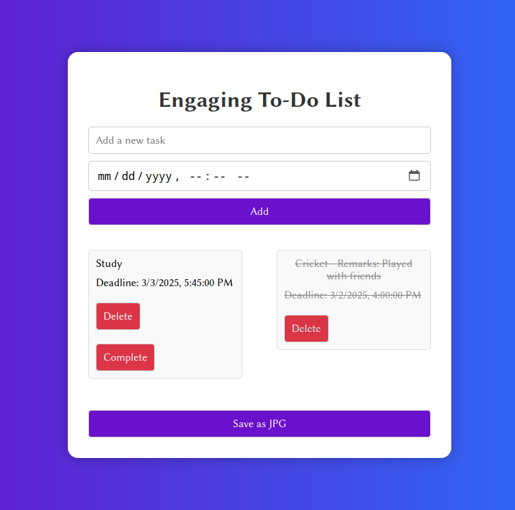

# To-Do List Project

This is a simple and engaging To-Do List application built with HTML, CSS, and JavaScript.

## Features

- Add tasks with deadlines
- Mark tasks as complete with remarks
- Delete tasks
- Save the list as PDF or JPG

## How to Run

1. Open `index.html` in a web browser.
2. Interact with the app by adding tasks, setting deadlines, marking them as complete, adding remarks, and saving the list as PDF or JPG.

## Preview

